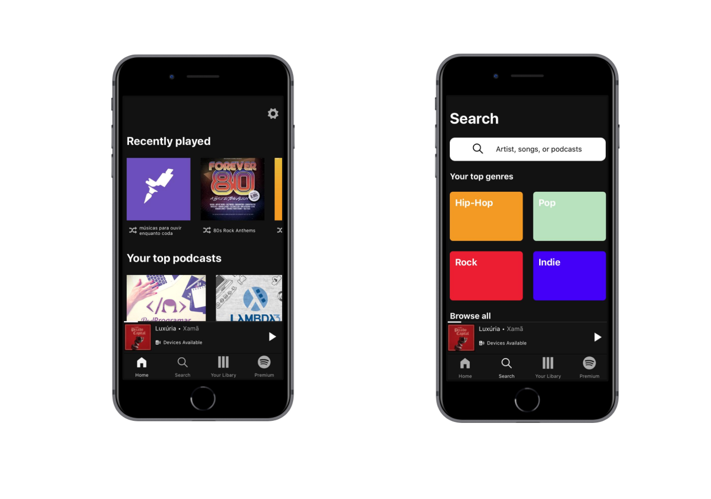
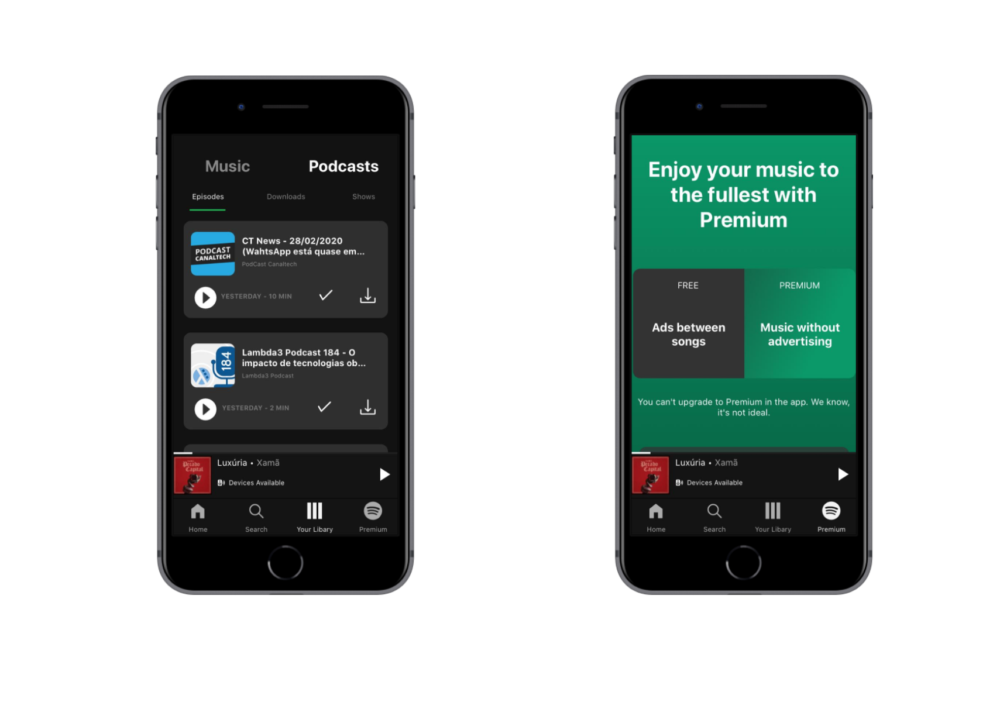

<h1  align="center">

</h1>

  
<h4  align="center">
	⚡ Spotify App
</h4>

  

<a  href="#telescope-projeto">🔭 Projeto</a>&nbsp;&nbsp;&nbsp;|&nbsp;&nbsp;&nbsp
<a  href="#computer-tecnologias"> 💻 Tecnologias</a>&nbsp;&nbsp;&nbsp;|&nbsp;&nbsp;&nbsp;
<a  href="#-preview">💜 Preview</a>&nbsp;&nbsp;&nbsp;|&nbsp;&nbsp;&nbsp;
<a  href="#-getting-started">🤠 Getting Started </a>

  

## :telescope: Projeto
 
 
Construção de interface utilizando o react native, consiste em clonar a interface do spotify, as informações como images de álbuns estão sendo consumidas através de uma API ( https://developer.spotify.com/documentation/web-api/quick-start/).

  
  
## :computer: Tecnologias

  

**Backend: API WEB Spotfy**
 
- https://developer.spotify.com/documentation/web-api/quick-start/ 

**:iphone: Mobile**
 
- [React Native;](https://facebook.github.io/react-native/) 

- [Expo;](https://expo.io/)

- [Axios;](https://github.com/axios/axios)

- [Socket-io.](https://socket.io/)

- [Styled Components](https://styled-components.com/)
  

## 💜 Preview
 

 

## 🤠 Getting Started

Você precisa clonar o repositório e pode fazer isso digitando em seu terminal `git clone https://github.com/AirtonFranco/spotify-clone-react-native.git`.
 

### :satellite: Backend

Após baixar o repositório entre na pasta que foi baixada `$ cd spotify-clone-react-native/` e execute `$ npm install` ou `$ yarn install`

### :iphone: Mobile
  
Após baixar as dependências execute `$ yarn start` ou `$ npm start` para executar o projeto, após isso leia o Qr code com seu celular, ele irá aparecer no navegador automaticamente.

--- 

<h5 align="center"> 🚀 Spotify  by Airton Silveira 💜 </h5>

---
